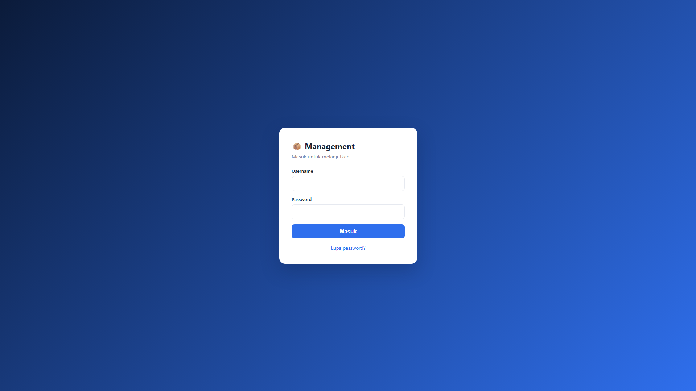
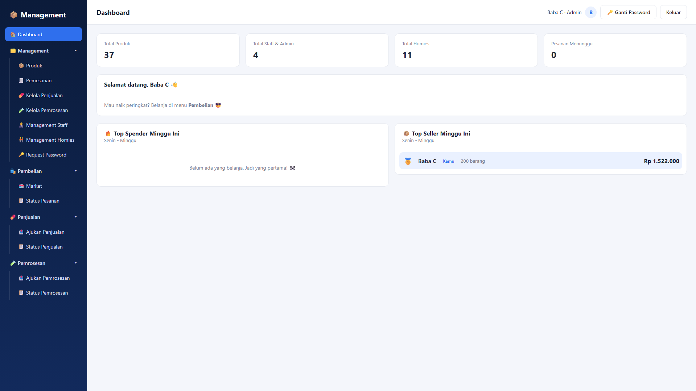
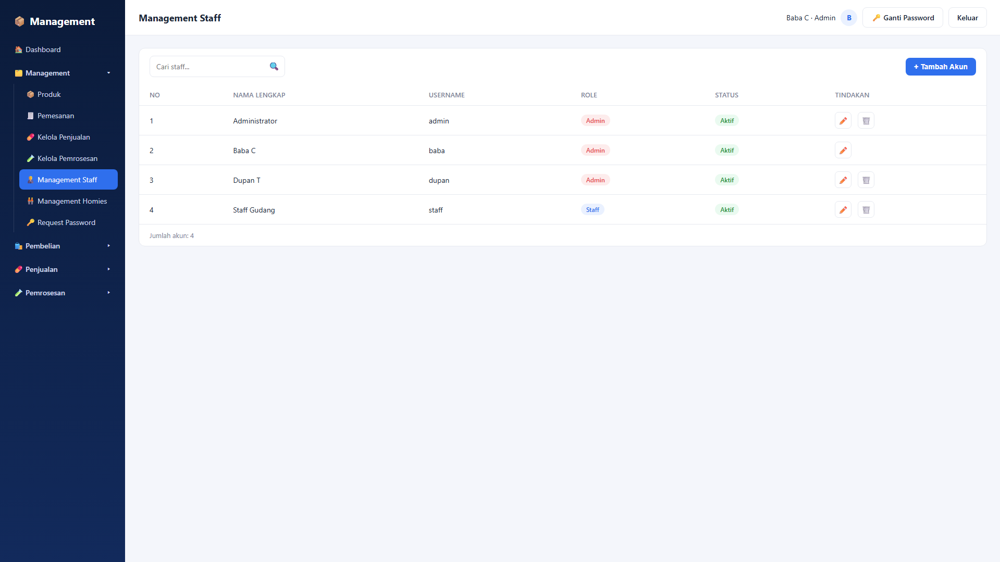
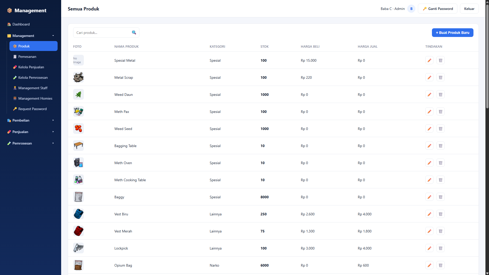
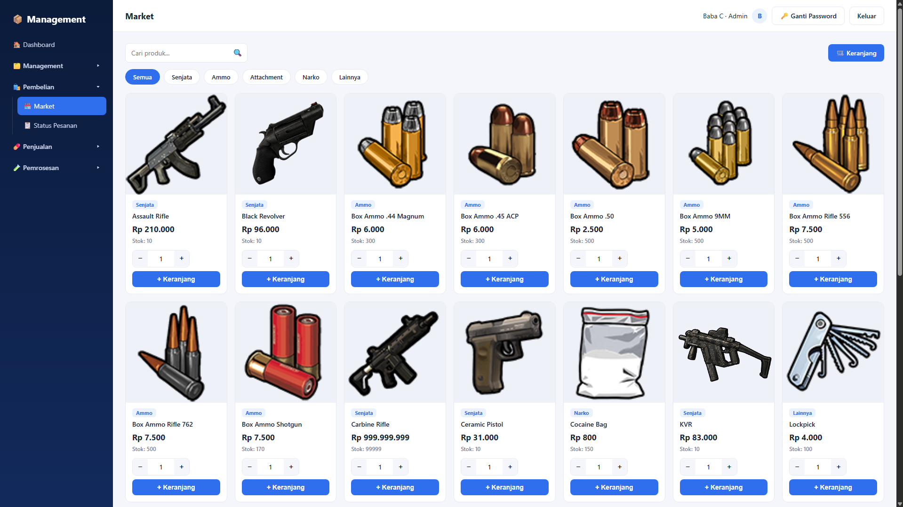
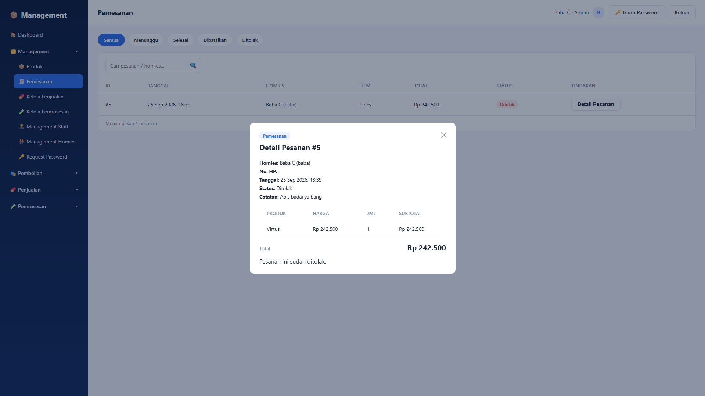
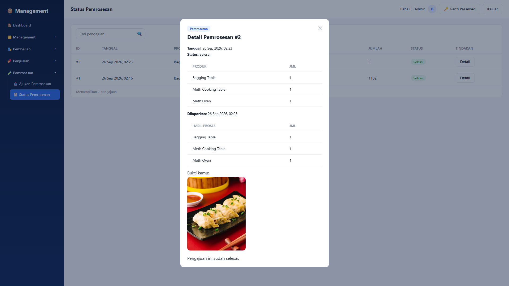

# BBC - Sistem Manajemen Toko & Gudang

Aplikasi web (PHP native + MySQL, tanpa framework) untuk mengelola stok produk (Senjata,
Ammo, Attachment, Narko, Spesial, Lainnya), akun Staff/Admin & Homies (member), alur belanja
(Pembelian & Pemesanan), alur jual-beli Narko (Penjualan), alur olah barang (Pemrosesan),
sampai fitur Homies jual balik barang ke toko (Jual Barang) — lengkap dengan leaderboard
Top Spender & Top Seller di Dashboard.

## Struktur Folder

```
bbc/
├── config/
│   ├── db.php                         -> koneksi database + auto-seed akun admin default kalau tabel users kosong
│   └── heriansyah_management.sql      -> script buat database + seed data (produk & akun contoh)
├── includes/
│   ├── auth.php                       -> session, require_login()/require_admin()/require_management(),
│   │                                      helper role, keranjang (cart), konstanta kategori/min qty, dsb
│   ├── header.php                     -> head + layout + topbar (dipakai semua halaman)
│   ├── sidebar.php                    -> menu sidebar (dropdown Management/Pembelian/Penjualan/Pemrosesan,
│   │                                      badge jumlah item yang masih menunggu diproses)
│   └── footer.php                     -> penutup layout + include JS
├── staff/
│   ├── management_staff.php           -> (admin only) list akun admin/staff + form tambah akun
│   ├── edit_staff.php                 -> (admin only) edit akun (nama, role, status, reset password)
│   └── hapus_staff.php                -> (admin only) hapus akun
├── homies/
│   ├── management_homies.php          -> (admin & staff) list homies + form tambah homies (nama, no HP, Discord ID)
│   ├── edit_homies.php                -> (admin & staff) edit data homies
│   ├── hapus_homies.php               -> (admin & staff) hapus homies
│   └── request_password.php           -> (admin & staff) approve/tolak permintaan reset password dari homies
├── produk/
│   ├── produk.php                     -> (admin & staff) master data produk: nama, kategori, foto, stok,
│   │                                      harga beli & harga jual
│   ├── edit_produk.php                -> (admin & staff) edit produk (termasuk ganti foto)
│   └── hapus_produk.php               -> (admin & staff) hapus produk (foto ikut dihapus dari server)
├── pembelian/
│   ├── market.php                     -> (semua role) katalog produk + tambah ke keranjang (filter kategori,
│   │                                      kategori Spesial tidak ditampilkan)
│   ├── keranjang.php                  -> (semua role) keranjang belanja, sinkron otomatis ke stok terbaru,
│   │                                      checkout jadi Pesanan
│   └── status_pesanan.php             -> (semua role) riwayat pesanan milik sendiri + tombol batalkan
│                                          (khusus status "menunggu")
├── pemesanan/
│   ├── pemesanan.php                  -> (admin & staff) daftar semua pesanan + filter status
│   └── proses_pesanan.php             -> (admin & staff) tandai pesanan Selesai / Tolak (tolak = stok balik)
├── penjualan/
│   ├── ajukan_penjualan.php           -> (semua role) ajukan jual Narko ke keranjang penjualan (minimal
│   │                                      qty per barang), checkout jadi pengajuan
│   ├── kelola_penjualan.php           -> (admin & staff) ACC / Tolak pengajuan, konfirmasi Selesai
│   ├── proses_penjualan.php           -> proses aksi ACC/Tolak/Selesai pengajuan penjualan Narko
│   ├── status_penjualan.php           -> (semua role) status pengajuan sendiri + lapor hasil uang & link
│   │                                      bukti setelah di-ACC
│   ├── jual_barang.php                -> (semua role) Homies jual barang balik ke toko dari daftar
│   │                                      whitelist (diatur admin/staff), stok toko baru bertambah saat di-ACC
│   ├── kelola_jual_barang.php         -> (admin & staff) ACC / Tolak pengajuan Jual Barang
│   ├── proses_jual_barang.php         -> proses aksi ACC/Tolak pengajuan Jual Barang
│   └── status_jual_barang.php         -> (semua role) status pengajuan Jual Barang milik sendiri
├── pemrosesan/
│   ├── ajukan_pemrosesan.php          -> (semua role) ajukan ambil produk kategori Spesial untuk diolah
│   ├── kelola_pemrosesan.php          -> (admin & staff) ACC / Tolak pengajuan, konfirmasi hasil Selesai
│   ├── proses_pemrosesan.php          -> proses aksi ACC/Tolak/Selesai pengajuan pemrosesan
│   ├── keranjang_pemrosesan.php       -> keranjang pengajuan pemrosesan (session)
│   └── status_pemrosesan.php          -> (semua role) status pengajuan sendiri + lapor hasil olahan
│                                          (item hasil + link bukti); stok hasil baru masuk saat dikonfirmasi Selesai
├── assets/
│   ├── css/style.css                  -> SATU file CSS untuk semua halaman
│   ├── js/script.js                   -> interaksi sidebar, modal, search-select, live search tabel, dsb
│   └── uploads/                       -> folder foto produk hasil upload
├── cgi-bin/.htaccess                  -> Options -Indexes (proteksi listing folder)
├── index.php                          -> halaman login
├── logout.php                         -> proses logout
├── lupa_password.php                  -> halaman publik: homies kirim permintaan reset password
├── ganti_password.php                 -> ganti password akun sendiri (juga dipakai saat wajib ganti
│                                          password setelah direset admin/staff)
└── dashboard.php                      -> halaman setelah login (statistik + leaderboard Top Spender & Top Seller)
```

## Cara Menjalankan (XAMPP/Laragon)

1. Copy folder `bbc` ke `htdocs` (XAMPP) atau `www` (Laragon).
2. Buka phpMyAdmin, import file `config/heriansyah_management.sql`.
3. Cek `config/db.php`, sesuaikan `$DB_HOST` / `$DB_USER` / `$DB_PASS` / `$DB_NAME` kalau perlu.
4. Jalankan Apache + MySQL, lalu buka `http://localhost/bbc/index.php`.
5. Kalau tabel `users` masih kosong, akun **admin / admin123** otomatis dibuat lewat `db.php`
   saat pertama kali halaman dibuka (hash password dibuat via `password_hash()` PHP).

Butuh **PHP 7.0+** (pakai null coalescing `??`) dan ekstensi **mysqli** aktif — default sudah
aktif di XAMPP/Laragon versi mana pun.

## Role & Akun

| Role   | Akses                                                                                      |
|--------|---------------------------------------------------------------------------------------------|
| Admin  | Semua fitur, termasuk Management Staff (khusus admin)                                       |
| Staff  | Semua fitur Management kecuali Management Staff                                             |
| Homies | Dashboard, Pembelian (Market/Keranjang/Status Pesanan), Penjualan, Jual Barang, Pemrosesan   |

Akun default hasil auto-seed: `admin` / `admin123`. Akun staff & homies dibuat lewat
Management Staff / Management Homies setelah login.

## Fitur

- **Login & session**: hanya bisa masuk ke halaman manapun setelah login (`require_login()`);
  belum login otomatis diarahkan ke `index.php`. Ada halaman **Lupa Password** untuk homies
  ajukan reset (disetujui admin/staff lewat **Request Password**, password sementara `123`
  lalu wajib diganti saat login berikutnya lewat `ganti_password.php`).
- **3 Role**: admin, staff & homies, disimpan di kolom `role` tabel `users`.
- **Dashboard**: statistik Total Produk/Staff/Homies/Pesanan Menunggu (khusus admin & staff)
  serta leaderboard **Top Spender** (total belanja pesanan selesai) dan **Top Seller**
  (total barang yang berhasil dijual lewat Jual Barang), dihitung per minggu berjalan.
- **Management Staff** (khusus admin): tambah, edit, hapus akun admin/staff, reset password,
  ubah status aktif/nonaktif.
- **Management Homies** (admin & staff): tambah/edit/hapus data homies (nama, username,
  password, no HP, Discord ID).
- **Produk** (admin & staff, master data): nama, kategori (Senjata/Ammo/Attachment/Narko/
  Lainnya/Spesial), foto (upload jpg/jpeg/png/webp), stok, harga beli & harga jual.
- **Pembelian**: Market (katalog produk, kategori Spesial disembunyikan) → Keranjang (auto
  sinkron ke stok terbaru) → checkout jadi **Pesanan**; homies bisa batalkan pesanan sendiri
  selama masih "menunggu". Admin/staff memproses lewat **Pemesanan** (Selesai/Tolak, tolak =
  stok dikembalikan).
- **Penjualan** (khusus produk kategori Narko, minimal qty per barang): homies **Ajukan
  Penjualan** → admin/staff **ACC/Tolak** → homies **lapor hasil** (jumlah uang + link bukti)
  → admin/staff konfirmasi **Selesai**.
- **Jual Barang** (kebalikan Penjualan — homies jual barang ke toko): hanya produk yang
  di-**whitelist** admin/staff yang bisa diajukan; stok toko baru bertambah saat pengajuan
  di-**ACC** (tanpa tahap lapor hasil, ACC = final).
- **Pemrosesan** (khusus produk kategori Spesial, tidak tampil di Market): homies **Ajukan
  Pemrosesan** → admin/staff **ACC/Tolak** → homies **lapor hasil olahan** (item hasil dari
  kategori Narko/Spesial + link bukti) → admin/staff konfirmasi **Selesai**, baru saat itu
  stok hasil olahan bertambah.
- **Ganti Password**: verifikasi password lama (kecuali mode wajib ganti), simpan password baru
  (di-hash `password_hash()`), tidak boleh sama dengan password lama.

## Teknologi

- PHP native (tanpa framework) + `mysqli` (prepared statements di semua query yang menerima
  input pengguna), transaksi (`mysqli_begin_transaction`) untuk aksi yang mengubah stok.
- MySQL / MariaDB.
- Vanilla JS (tanpa library) untuk interaksi UI: toggle sidebar, modal konfirmasi hapus,
  live search tabel, dan komponen search-select.
- 1 file CSS (`assets/css/style.css`) untuk seluruh halaman, tanpa CSS framework.

### 📄 Tampilan 1


### 📄 Tampilan 2


### 📄 Tampilan 3


### 📄 Tampilan 4


### 📄 Tampilan 5


### 📄 Tampilan 6


### 📄 Tampilan 7
